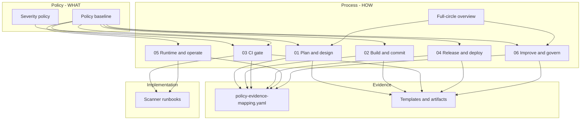

# Policy and process alignment

**Purpose:** Show how the **policy baseline** (what must be done) and the **full-circle program** (how teams operate) fit together.

**Use this document when:**

- **Leaders or GRC** need assurance that following the program satisfies corporate policy.
- **Engineering or platform** need to know which lifecycle phase and artifacts satisfy each policy control when wiring CI/CD.

**Canonical documents:**

| Layer | Document | Role |
|-------|----------|------|
| **Policy (WHAT)** | [`framework/appsec-policy-baseline.md`](framework/appsec-policy-baseline.md) | Normative MUST/SHOULD; auditable requirements |
| **Process (HOW)** | [`appsec-program-full-circle.md`](appsec-program-full-circle.md) + phases [`01`](program/01-plan-and-design.md)–[`06`](program/06-improve-and-govern.md) | Operating model across the SDLC |
| **Proof (EVIDENCE)** | [`framework/policy-evidence-mapping.yaml`](framework/policy-evidence-mapping.yaml) | Metadata fields, evidence types, pass criteria |
| **Implementation (TOOLS)** | [`runbooks/appsec/`](../../runbooks/appsec/) + [`templates/`](templates/) | Runnable scanners and standard forms |

Terms: [`glossary.md`](glossary.md).

---

## How they relate

The diagram below is optional; the bullet list and crosswalk tables state the same relationships for hosts that do not render Mermaid.

- **Policy** does not prescribe a single vendor or pipeline layout; it states **capabilities** and evidence.
- **Process** turns policy into **repeatable activities** by lifecycle phase (plan → build → CI → release → operate → govern).
- **Following the process** (minimum path below) is the **intended** way to meet the policy baseline, using the standard forms and reference CI jobs unless your organization substitutes **equivalent** controls that produce the same evidence.

This is **design intent** of this program documentation, not a legal certification. **Corporate Security** should confirm after local customization (placeholders, tools, RACI).

## Assurance statement (for program owners)

> **If an operating company runs the [minimum operating path](#minimum-operating-path) for each in-scope application**—registry metadata, phase activities, required CI jobs, release sign-off, triage, and exception discipline—**it will satisfy the MUST controls** in the adopted [policy baseline](framework/appsec-policy-baseline.md), subject to [documented gaps](#honest-gaps-and-exceptions) (SHOULD controls, optional runbooks, and org-specific customization).

**Reverse direction (for platform / AppSec engineering):**

> **If you implement CI/CD and registry controls per the policy baseline** (SAST, secrets, SCA, DAST where applicable, severity gates, release evidence), **you are implementing the technical core of phases 03–04** and supporting 02, 05, and 06. Use the phase playbooks for everything policy does not automate (design review, triage cadence, governance).

---

## Policy control to process

Crosswalk: policy control → process → artifacts.

Minified IDs (A1, B1, …) match [`appsec-policy-baseline-minified.md`](framework/appsec-policy-baseline-minified.md). Automation IDs (`AS-*`) match [`policy-evidence-mapping.yaml`](framework/policy-evidence-mapping.yaml) where defined.

| ID | Policy requirement (summary) | Process phase(s) | Primary program doc | Templates / runbooks |
|----|-------------------------------|------------------|---------------------|----------------------|
| **A1** | Application metadata maintained | 01, 06 | [01-plan-and-design](program/01-plan-and-design.md), [06-improve-and-govern](program/06-improve-and-govern.md) | Registry/catalog; [README](README.md) adoption step 2 |
| **A2** | Risk tier and review cadence | 01, 06 | [01-plan-and-design](program/01-plan-and-design.md), [06-improve-and-govern](program/06-improve-and-govern.md) | [risk-tier-rubric](templates/risk-tier-rubric.md), [data-classification-scheme](templates/data-classification-scheme.md) |
| **B1** | Security requirements (new / high-impact) | 01 | [01-plan-and-design](program/01-plan-and-design.md) | [adr-template](templates/adr-template.md); tickets / design docs |
| **B2** | Threat modeling (internet-facing / medium+ tier) | 01 | [01-plan-and-design](program/01-plan-and-design.md) | [threat-model-catalog-lite](templates/threat-model-catalog-lite.md) · [schema](templates/threat-model-catalog-schema.yaml) · `AS-DES-002` |
| **C1** | Secure coding standards | 02, 06 | [02-build-and-commit](program/02-build-and-commit.md), [06-improve-and-govern](program/06-improve-and-govern.md) | OWASP cheat sheets / internal standards; training in SAMM checklist |
| **C2** | PR security-impact checklist | 02 | [02-build-and-commit](program/02-build-and-commit.md) | [pr-security-checklist](templates/pr-security-checklist.md) |
| **D1** | SAST in CI | 02, 03 | [02-build-and-commit](program/02-build-and-commit.md), [03-ci-gate](program/03-ci-gate.md) | [SAST runbooks](../../runbooks/appsec/) · `AS-CI-001` |
| **D2** | Secrets scan in CI | 02, 03 | [02-build-and-commit](program/02-build-and-commit.md), [03-ci-gate](program/03-ci-gate.md) | [secrets runbooks](../../runbooks/appsec/) · `AS-CI-002` |
| **D3** | SCA in CI | 02, 03 | [02-build-and-commit](program/02-build-and-commit.md), [03-ci-gate](program/03-ci-gate.md) | [SCA runbooks](../../runbooks/appsec/) · `AS-CI-003` |
| **D4** | Baseline DAST (internet-facing) | 03, 04, 05 | [03-ci-gate](program/03-ci-gate.md), [04-release-and-deploy](program/04-release-and-deploy.md), [05-runtime-and-operate](program/05-runtime-and-operate.md) | [DAST runbooks](../../runbooks/appsec/) · `AS-CI-004` |
| **D5** | Severity fail thresholds | 03, 06 | [03-ci-gate](program/03-ci-gate.md), [06-improve-and-govern](program/06-improve-and-govern.md) | [severity-policy](framework/severity-policy.md) · `AS-CI-005` |
| **E1** | Release security evidence bundle | 04 | [04-release-and-deploy](program/04-release-and-deploy.md) | [release-sign-off-checklist](templates/release-sign-off-checklist.md) · `AS-REL-001` |
| **E2** | Container / IaC scanning (SHOULD) | 04 | [04-release-and-deploy](program/04-release-and-deploy.md) | Roadmap in [full-circle](appsec-program-full-circle.md) Known Gaps |
| **E3** | SBOM (SHOULD) | 04 | [04-release-and-deploy](program/04-release-and-deploy.md) | Roadmap in [full-circle](appsec-program-full-circle.md) Known Gaps |
| **F1** | Scheduled re-scan (internet-facing) | 05 | [05-runtime-and-operate](program/05-runtime-and-operate.md) | Scheduled DAST jobs; same runbooks as D4 |
| **F2** | Findings triage and SLA | 03, 05, 06 | [03-ci-gate](program/03-ci-gate.md), [05-runtime-and-operate](program/05-runtime-and-operate.md), [06-improve-and-govern](program/06-improve-and-govern.md) | Ticketing + [severity-policy](framework/severity-policy.md) · `AS-OPS-002` |
| **EX** | Exception governance + expiry | 03, 04, 06 | [03-ci-gate](program/03-ci-gate.md), [06-improve-and-govern](program/06-improve-and-govern.md) | [exception-request-form](templates/exception-request-form.md) · `AS-GOV-001` |

---

## Process phase to policy

Use this when rolling out the program to teams (“follow phases 01–06”).

| Phase | You operate… | Policy satisfied (MUST) |
|-------|----------------|-------------------------|
| **[01 Plan and design](program/01-plan-and-design.md)** | Requirements, threat models, classification, tiering | A1, A2, B1, B2 |
| **[02 Build and commit](program/02-build-and-commit.md)** | Secure coding, PR checklist, early scans | C1, C2; supports D1–D3 |
| **[03 CI gate](program/03-ci-gate.md)** | Required pipelines, severity gates, artifacts | D1, D2, D3, D4 (if internet-facing), D5, F2; EX when waiving |
| **[04 Release and deploy](program/04-release-and-deploy.md)** | Release evidence, pre-prod DAST, sign-off | D4, E1; EX validity |
| **[05 Runtime and operate](program/05-runtime-and-operate.md)** | Scheduled scans, triage, incidents | F1, F2; D4 ongoing |
| **[06 Improve and govern](program/06-improve-and-govern.md)** | Metrics, exceptions, tier review, policy tuning | A2, D5, F2, EX; continuous A1 |

**Full-circle overview** ([`appsec-program-full-circle.md`](appsec-program-full-circle.md)) ties the phases together, lists tooling, and tracks **known gaps** not yet fully automated in runbooks.

---

## Minimum operating path

Corporate Security can cite this as the **default compliance path** for operating companies (customize cadence and tooling names).

1. **Register** every in-scope app with required metadata (A1) and assign **risk tier** (A2) using the [risk-tier rubric](templates/risk-tier-rubric.md).
2. **Plan:** For new/high-impact work, capture security requirements (B1); threat-model when internet-facing or medium/high tier (B2).
3. **Build:** Use [PR security checklist](templates/pr-security-checklist.md) (C2) and secure coding standards (C1).
4. **CI:** Run SAST, secrets, SCA on PR and default branch; DAST for internet-facing apps; enforce [severity policy](framework/severity-policy.md) (D1–D5). Use [scanner runbooks](../../runbooks/appsec/).
5. **Release:** Complete [release sign-off](templates/release-sign-off-checklist.md) with scan evidence (E1); no expired exceptions (EX).
6. **Operate:** Schedule re-scans for internet-facing apps (F1); triage findings to SLA (F2).
7. **Govern:** Quarterly tier review, exception audit, and metrics (06); file exceptions only via [exception form](templates/exception-request-form.md).

**Adoption order:** [README — recommended adoption order](README.md#recommended-adoption-order-policy-through-maturity).

---

## Honest gaps and exceptions

Following the process **does not by itself** prove compliance if these are left undone:

| Topic | Policy | Process / repo status |
|-------|--------|------------------------|
| Container / IaC scan, SBOM | E2, E3 (SHOULD) | Described in phase 04; **no first-class runbook yet** — see [Known gaps](README.md#known-gaps-program-not-final--intentional) |
| Formal training / champions | C1, SAMM Education | Referenced in 06 and SAMM checklist; **no full training package** in repo |
| Central findings dashboard | F2 | Process expects ticketing; **aggregation platform is org-specific** |
| Policy ↔ automation | Some controls (B1, C1, C2) | In baseline text; **not all have `AS-*` rows** in YAML yet — extend mapping as you automate |
| Tool choice | Policy is capability-based | Process references **OSS runbooks**; managed tools (Snyk, etc.) are valid if evidence matches |

**Stricter is always allowed.** **Weaker** than policy requires an approved **exception** (EX).

---

## Who should read what

| Audience | Start here | Then |
|----------|------------|------|
| **Executive / GRC** | Assurance statement above | [Policy baseline](framework/appsec-policy-baseline.md) |
| **AppSec program owner** | This page + [full-circle](appsec-program-full-circle.md) | [Implementation checklist](program/implementation-master-checklist.md) |
| **Engineering leadership** | [Minimum operating path](#minimum-operating-path) | Phase [01](program/01-plan-and-design.md)–[06](program/06-improve-and-govern.md) |
| **Platform / DevEx** | Crosswalk D1–D5, E1 | [03 CI gate](program/03-ci-gate.md) + [scanner table](README.md#scanner-runbooks-and-ci-templates) |

---

*When the policy baseline or phase docs change, update this crosswalk in the same change set.*
