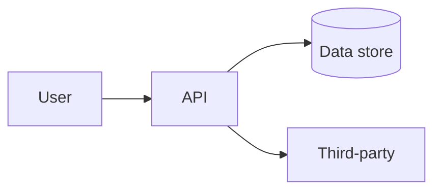

# Threat model — full template (optional)

**Purpose:** Deeper threat assessment when the [catalog lite](threat-model-catalog-lite.md) form is not enough—multiple components, formal diagrams, or per-flow STRIDE tables.

**Default for inventory/catalog:** Use **[threat-model-catalog-lite.md](threat-model-catalog-lite.md)** + **[threat-model-catalog-schema.yaml](threat-model-catalog-schema.yaml)**. Attach a diagram only via `diagram_url` if you have one; **Threat Dragon is not required**.

**Policy:** Same control **B2** / evidence `threat_model_document` when approved.

**When required:** `internet_facing == true` OR `risk_tier` in (`medium`, `high`) — or per org rubric.

---

## Document control

| Field | Value |
|-------|--------|
| Application / service | |
| `app_id` | |
| Feature or release scope | |
| `risk_tier` | low / medium / high |
| `data_classification` | |
| Author | |
| Reviewers (engineering, AppSec) | |
| Status | Draft / In review / Approved |
| Version / date | |
| Link to ticket / epic / ADR | |
| Catalog lite record URL (if also filed in inventory) | |

---

## 1. Overview

**Summary (2–4 sentences):** What is being built or changed? Who are the actors?

**In scope / out of scope:**

- In scope:
- Out of scope:

---

## 2. Architecture and data flows

Optional diagram (Mermaid, exported image, or Threat Dragon). If stored externally, put the link in catalog **`diagram_url`** instead of embedding here.

**Trust boundaries:** List where trust level changes.

| From | To | Protocol | Data types | Classification |
|------|-----|----------|------------|----------------|
| | | | | |

**Authentication and authorization:** How are users and services identified? How are permissions enforced?

---

## 3. Assets and security objectives

| Asset | Why it matters | Security objective (C/I/A) |
|-------|----------------|----------------------------|
| e.g. User credentials | Account takeover | Confidentiality, Integrity |
| | | |

---

## 4. STRIDE analysis (detailed)

For each **in-scope** component or flow, record threats.

| ID | Component / flow | Category (STRIDE) | Threat description | Likelihood (L/M/H) | Impact (L/M/H) | Mitigation / control | Status | Ticket |
|----|------------------|-------------------|----------------------|--------------------|----------------|----------------------|--------|--------|
| T-01 | | Spoofing | | | | | | |
| T-02 | | Tampering | | | | | | |
| T-03 | | Repudiation | | | | | | |
| T-04 | | Information disclosure | | | | | | |
| T-05 | | Denial of service | | | | | | |
| T-06 | | Elevation of privilege | | | | | | |

**Accepted risks:** File [exception-request-form.md](exception-request-form.md) with approval and expiry.

---

## 5. Security requirements

| ID | Requirement | Verification |
|----|-------------|--------------|
| SR-01 | | |
| SR-02 | | |

---

## 6. Dependencies and third parties

| Dependency / vendor | Purpose | Data shared | Review status |
|---------------------|---------|-------------|---------------|
| | | | |

---

## 7. Review and approval

| Role | Name | Date | Outcome |
|------|------|------|---------|
| Engineering lead | | | |
| AppSec (if required) | | | |
| Product / business (if high tier) | | | |

---

## 8. Maintenance

Re-open when auth model, integrations, data classes, or exposure change.

**Storage:** Repo `docs/security/threat-models/` and/or catalog record from [catalog lite](threat-model-catalog-lite.md).
