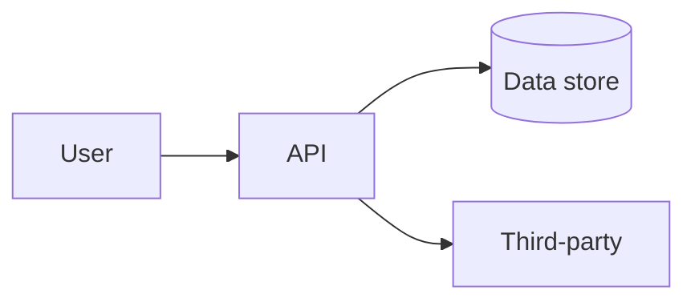

# Threat model (template)

**Purpose:** Lightweight threat assessment for a feature, service, or release. Satisfies design-phase evidence (`threat_model_document`, `design_review_record`) per [policy baseline](../framework/appsec-policy-baseline.md).

**When required:** `internet_facing == true` OR `risk_tier` in (`medium`, `high`) for the scoped change — or per org rubric.

---

## Document control

| Field | Value |
|-------|--------|
| Application / service | |
| `app_id` | |
| Feature or release scope | |
| `risk_tier` | low / medium / high |
| `data_classification` | |
| Author | |
| Reviewers (engineering, AppSec) | |
| Status | Draft / In review / Approved |
| Version / date | |
| Link to ticket / epic / ADR | |

---

## 1. Overview

**Summary (2–4 sentences):** What is being built or changed? Who are the actors?

**In scope / out of scope:**

- In scope:
- Out of scope:

---

## 2. Architecture and data flows

Insert a diagram (Mermaid, Threat Dragon export, or image) showing components, trust boundaries, and data flows.

**Trust boundaries:** List where trust level changes (e.g. browser → API, API → database, API → vendor).

| From | To | Protocol | Data types | Classification |
|------|-----|----------|------------|----------------|
| | | | | |

**Authentication and authorization:** How are users and services identified? How are permissions enforced?

---

## 3. Assets and security objectives

| Asset | Why it matters | Security objective (C/I/A) |
|-------|----------------|----------------------------|
| e.g. User credentials | Account takeover | Confidentiality, Integrity |
| | | |

---

## 4. STRIDE analysis

For each **in-scope** component or flow, record threats. Link mitigations to tickets, controls, or ADRs.

| ID | Component / flow | Category (STRIDE) | Threat description | Likelihood (L/M/H) | Impact (L/M/H) | Mitigation / control | Status (Open / Mitigated / Accepted) | Ticket |
|----|------------------|-------------------|----------------------|--------------------|----------------|----------------------|----------------------------------------|--------|
| T-01 | | Spoofing | | | | | | |
| T-02 | | Tampering | | | | | | |
| T-03 | | Repudiation | | | | | | |
| T-04 | | Information disclosure | | | | | | |
| T-05 | | Denial of service | | | | | | |
| T-06 | | Elevation of privilege | | | | | | |

**Accepted risks:** If any threat is accepted, file [exception-request-form.md](exception-request-form.md) — do not leave “Accepted” without approval and expiry.

---

## 5. Security requirements

Derived requirements for implementation and verification (map to ASVS or internal controls where helpful).

| ID | Requirement | Verification (test, scan, review) |
|----|-------------|-----------------------------------|
| SR-01 | e.g. All external input validated server-side | Unit tests + SAST |
| SR-02 | | |

---

## 6. Dependencies and third parties

| Dependency / vendor | Purpose | Data shared | Review status |
|---------------------|---------|-------------|---------------|
| | | | |

---

## 7. Review and approval

| Role | Name | Date | Outcome (Approve / Changes required) |
|------|------|------|--------------------------------------|
| Engineering lead | | | |
| AppSec (if required) | | | |
| Product / business (if high tier) | | | |

**Conditions / follow-ups:**

---

## 8. Maintenance

Re-open this model when:

- Authentication, authorization, or session model changes
- New external integration or data class
- Material exposure change (e.g. becomes internet-facing)
- Post-incident lessons learned

**Storage:** `docs/security/threat-models/YYYY-MM-DD-<feature>.md` (or your registry attachment).
